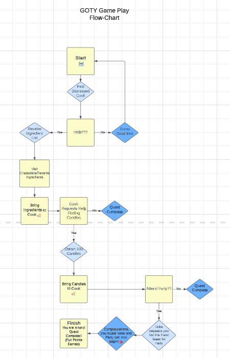

# GOTY
Marla and Isaac's Game of the Year, *Cook's Assistant*

Let the adventure begin! 

In this game, you are transported to the Renaissance Period where you happen across JoshTheCook for whom is the head cook for a Duke.  He pleads for your help in obtaining several ingredients that are needed to bake a birthday cake for the Duke. Meet different characters along your way. Complete the quest and save JoshTheCook from the Duke's wrath.  

This is a text based adventure style game loosely based off of the *Old School Rune Scape* online role-playing game.  To view a copy of the transcript we used for general guidance, click this [LINK](https://oldschool.runescape.wiki/w/Transcript:Cook%27s_Assistant).

## Tech & Tools
What we used to create this game:

- C#
- .NET SDK
- Git
- Visual Studio Code

**Game Play Flow-Chart**

- *Cook's Assistant* was created as a result of Isaac and Marla's class assignment requiring them to come up with a simple game in the form of a Console Application for their Software Development course with [Eleven Fifty Academy](https://www.elevenfifty.org/)

